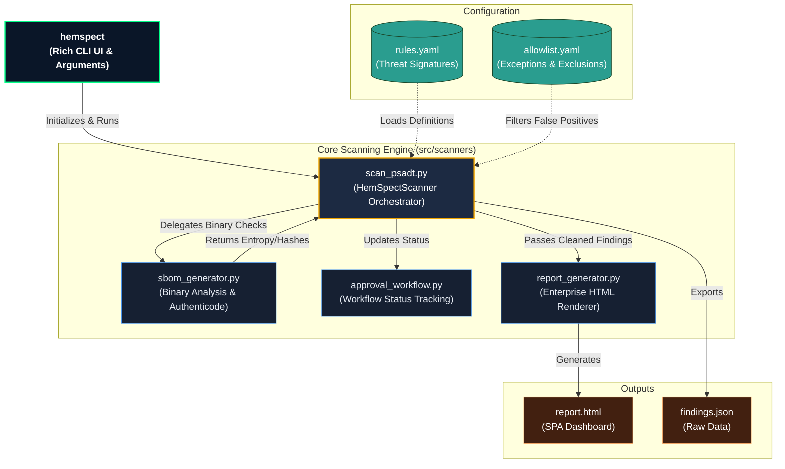

# High-Level Architecture

This diagram provides a conceptual overview of the HemSpect architecture. It visualizes how the CLI entrypoint coordinates the core scanner engines and how various specialized modules interact to produce enterprise-grade security reports.

## Key Components

1. **CLI Orchestrator:** The primary interface for operators and CI/CD pipelines. It parses arguments, initializes the environment, and invokes the core engine.
2. **HemSpectScanner:** The "brain" of the operation. It ingests threat signatures from `rules.yaml`, executes the multi-stage scanning process, and evaluates files against the `allowlist.yaml` definitions.
3. **Report Generator:** Transforms raw JSON telemetry and security findings into an interactive, zero-dependency HTML dashboard for security analysts.
