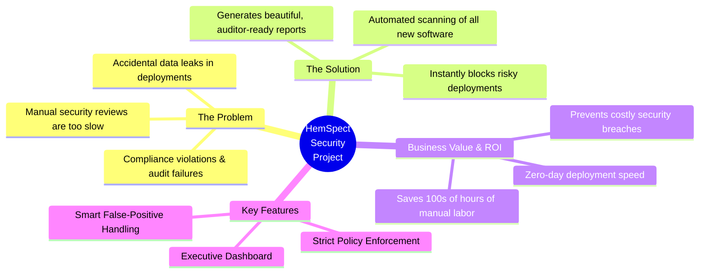

# HemSpect Project Overview (Manager View)

This presentation chart is built specifically for a **non-technical manager**. It completely avoids technical jargon and instead focuses on the "Why": the business problem, the solution your project provides, and the return on investment (ROI).

You can use this to easily justify the project's value and demonstrate how it protects the organization.

> [!TIP]
> **Talking Points for your Manager:**
> * **Time = Money:** Emphasize that what used to take days of manual security review now takes literally *seconds*.
> * **Risk Mitigation:** Explain that this tool acts as an automated "gatekeeper" that physically prevents developers from deploying code containing hardcoded passwords or malware.
> * **Audit Readiness:** Managers love compliance. Show them that the HTML report automatically maps issues to compliance standards (like NIST or CIS), making the next audit a breeze.
