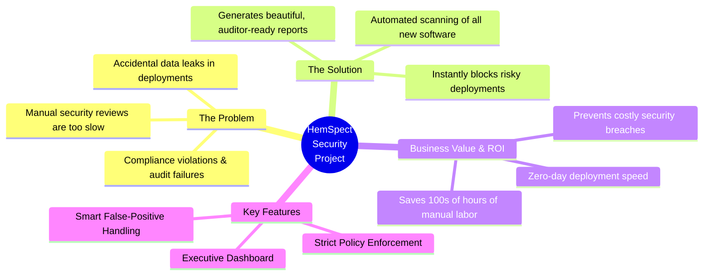

# Executive Summary

HemSpect provides an automated, comprehensive security analysis for enterprise software deployments (specifically focusing on the PowerShell App Deployment Toolkit - PSADT). This project aims to bridge the gap between rapid software deployment and strict enterprise security compliance.

## Core Value Proposition

## Strategic Benefits

* **Operational Efficiency:** Transforms manual, multi-day security code reviews into automated scans that complete in seconds, accelerating software delivery.
* **Risk Mitigation:** Acts as an automated enforcement gate, preventing deployments that contain hardcoded credentials, malware patterns, or data leakage vulnerabilities from reaching production endpoints.
* **Audit Readiness:** Automatically maps security findings to industry compliance standards (NIST SP 800-53, CMMC 2.0, CIS Controls v8), providing clear, demonstrable evidence for auditors.
