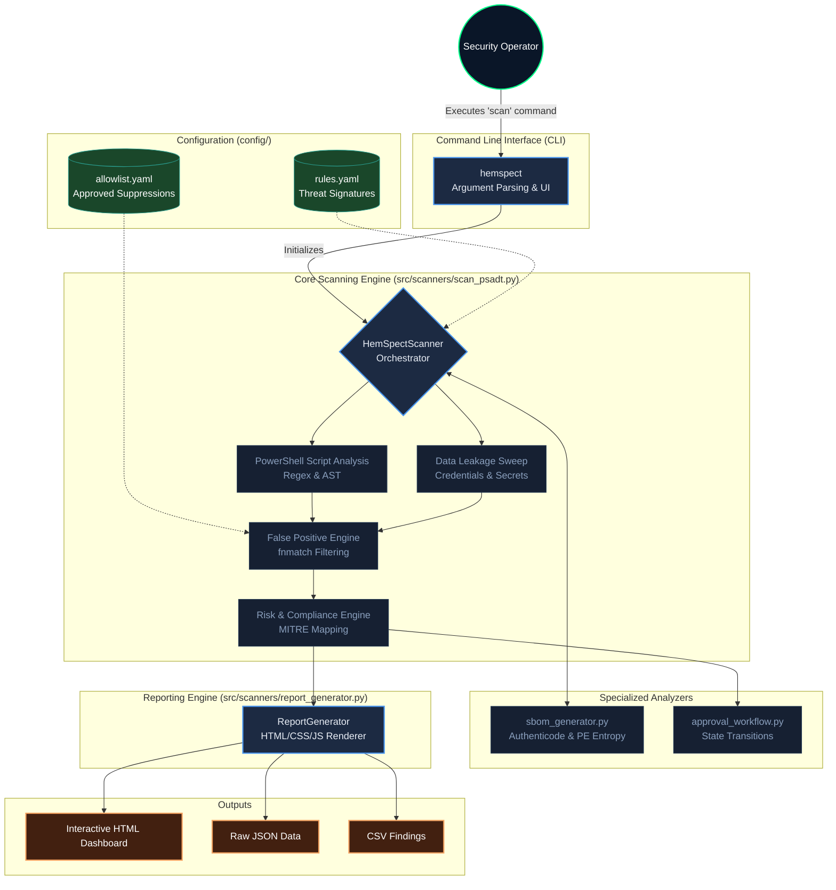

# HemSpect System Architecture

This document provides a comprehensive overview of the HemSpect package security scanner, including its internal architecture, the underlying technology stack, and a glossary of common terminology.

## System Architecture Diagram

## Tech Stack Breakdown

HemSpect is designed to be a lightweight, portable, and extremely fast security scanner that requires minimal external dependencies.

*   **Core Engine:** **Python 3**
    *   *Why:* Ensures cross-platform compatibility and rapid text/regex processing.
*   **Security Analysis:**
    *   **pefile:** Used for deep binary analysis, extracting Authenticode signatures, and calculating file entropy (detecting packed malware).
    *   **PyYAML:** Used for parsing `rules.yaml` (threat signatures) and `allowlist.yaml` (suppressions).
*   **User Interface (CLI):**
    *   **Rich:** Powers the beautiful, matrix-style terminal interface, progress bars, and colored console outputs.
*   **Reporting (Web):**
    *   **HTML5 / CSS3:** Uses a custom, zero-dependency dark theme (Deep Navy & Gold) to generate a premium Single Page Application (SPA).
    *   **Vanilla JavaScript:** Powers the interactive elements (expanding rows, password masking, SVG doughnut charts) without requiring heavy frontend frameworks like React or Vue.

## Project Glossary

Below is a glossary of abbreviations and terminology heavily used throughout the HemSpect architecture:

| Abbreviation | Definition | Description |
| :--- | :--- | :--- |
| **PSADT** | PowerShell App Deployment Toolkit | The primary target framework HemSpect was built to scan. An industry-standard wrapper used to deploy software via SCCM/Intune. |
| **SBOM** | Software Bill of Materials | An inventory of all files, hashes, and binaries included inside a software package. |
| **FP** | False Positive | A security alert that is technically correct but contextually safe (e.g., a dummy password inside a test file). |
| **CWE** | Common Weakness Enumeration | A community-developed list of common software security weaknesses (e.g., CWE-798: Use of Hard-coded Credentials). |
| **MITRE** | MITRE ATT&CK Framework | A globally-accessible knowledge base of adversary tactics and techniques (e.g., T1059: Command and Scripting Interpreter). |
| **SCCM** | System Center Configuration Manager | Microsoft's enterprise software deployment tool (now part of Microsoft Endpoint Manager). |
| **TS** | Task Sequence | A mechanism in SCCM used to perform complex tasks, often recommended by HemSpect for securely storing secrets instead of hardcoding them. |
| **SPA** | Single Page Application | The architecture used for HemSpect's `report.html`, allowing users to filter, sort, and expand findings without reloading the page. |
| **AMSI** | Antimalware Scan Interface | A Windows standard that allows applications to integrate with antivirus products. HemSpect detects scripts attempting to bypass AMSI. |
| **UAC** | User Account Control | A Windows security feature. HemSpect detects techniques attempting to bypass UAC prompts. |
| **DPAPI** | Data Protection API | A Windows cryptographic API recommended by HemSpect as a secure alternative to plain-text SecureStrings. |
| **NIST / CIS** | National Institute of Standards and Technology / Center for Internet Security | Regulatory compliance frameworks. HemSpect automatically maps code findings to these enterprise compliance controls. |
