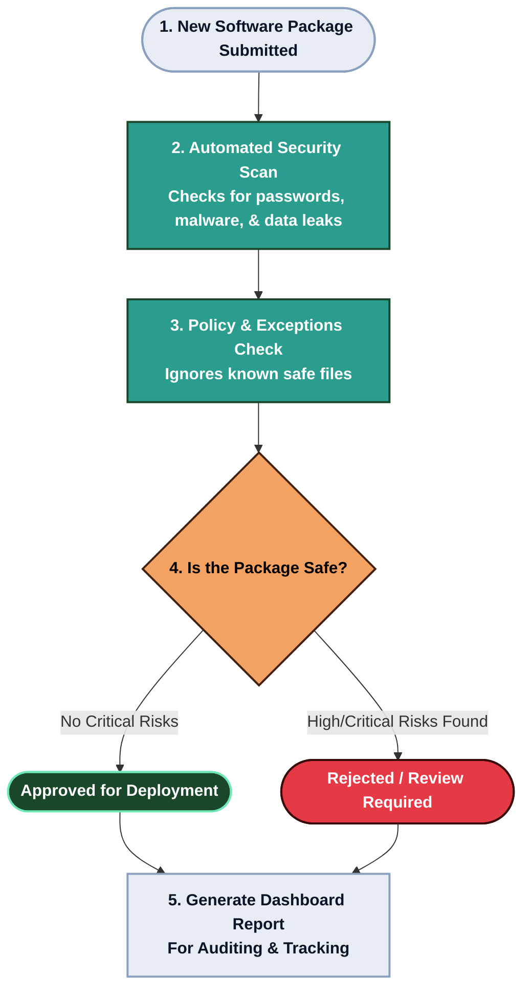

# Process Workflow

This flowchart outlines the automated decision-making process within HemSpect. It details the journey of a software package from submission to final approval, illustrating how security policies are enforced at each stage.

## Package Security Lifecycle

## Workflow Phases

1. **Automated Analysis:** HemSpect performs a deep, multi-engine scan without requiring human intervention, identifying structural flaws, malware signatures, and hardcoded secrets.
2. **Policy Adherence:** Utilizing the configurable `allowlist.yaml`, the engine intelligently filters out known false positives to prevent alert fatigue.
3. **Decisive Action:** Packages failing to meet organizational security thresholds are automatically blocked, generating alerts for the security team, while safe packages are cleared for deployment.
